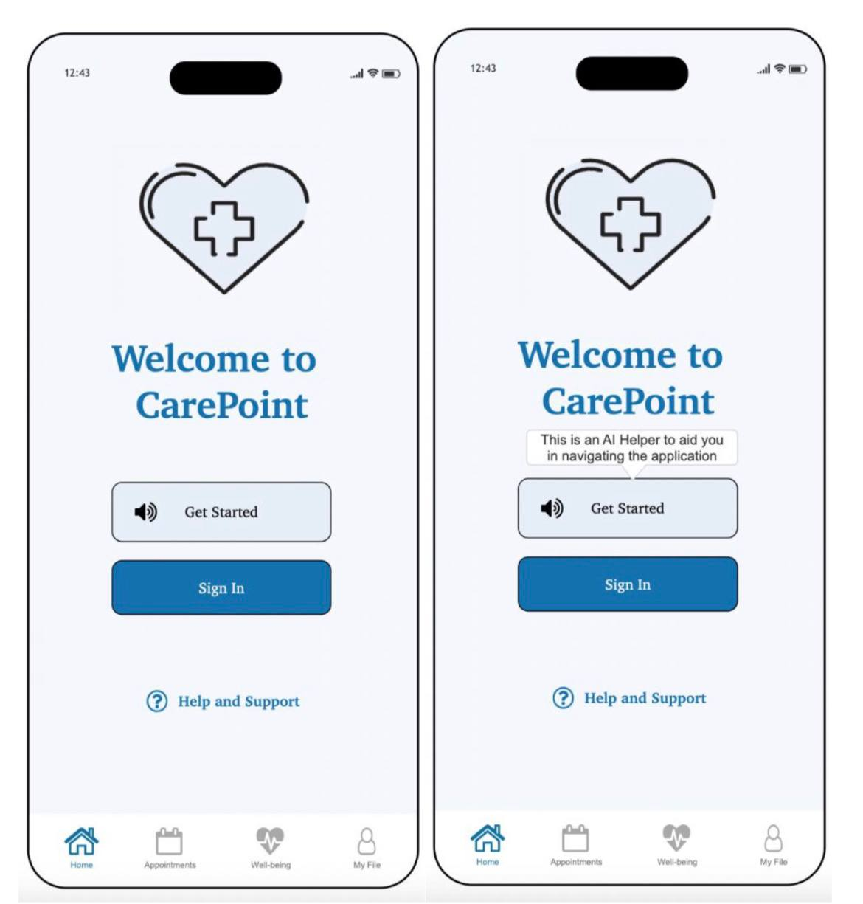
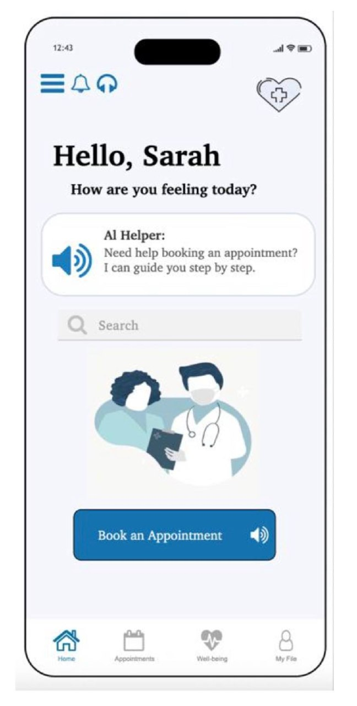
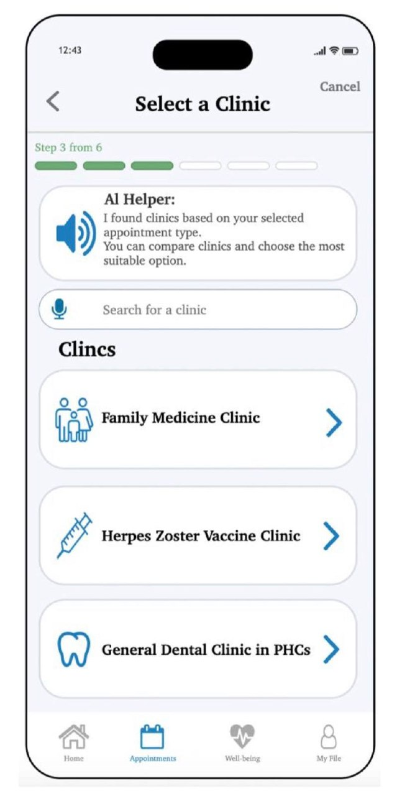
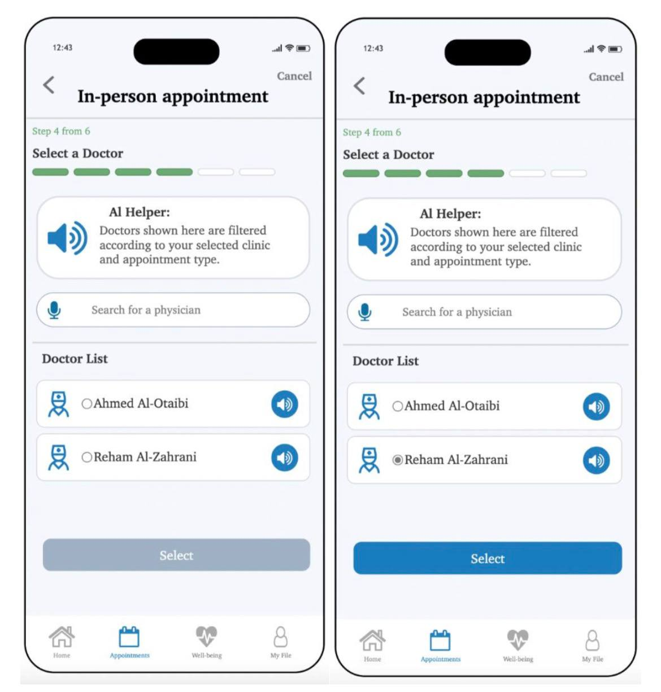
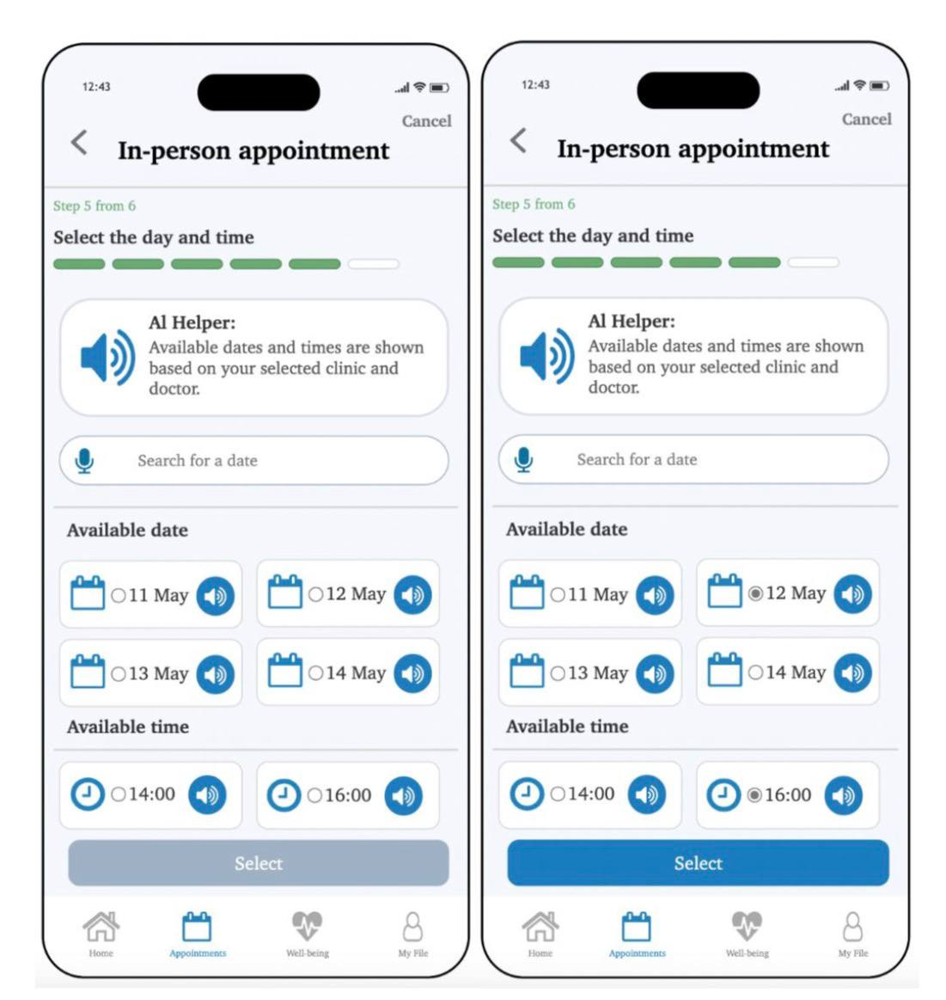
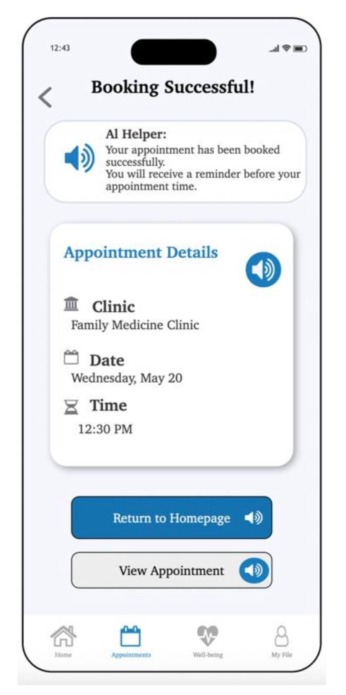

# CarePoint

> A high-fidelity healthcare appointment booking prototype designed to improve accessibility for visually impaired users by integrating Explainable Artificial Intelligence (XAI) with Human-Computer Interaction (HCI) principles.


## Overview

CarePoint is a high-fidelity prototype developed using **Axure RP** to improve the accessibility of digital healthcare services for visually impaired users. The prototype reimagines the appointment booking experience by providing clear guidance, accessible navigation, and Explainable Artificial Intelligence (XAI) features that help users complete tasks with greater confidence and independence.

This project was developed as part of the **CIS 422 – Human-Computer Interaction** course at **Imam Abdulrahman Bin Faisal University**.

---

## Features

* Accessible appointment booking workflow
* Explainable AI (XAI) guidance
* Audio-assisted interactions
* In-person and virtual appointment booking
* Clinic and doctor selection
* Appointment scheduling and confirmation
* User-centered interface design

---

## Technologies

* Axure RP
* Human-Computer Interaction (HCI)
* Explainable Artificial Intelligence (XAI)
* User-Centered Design (UCD)

---

## Screenshots

The following screenshots showcase the CarePoint prototype developed using **Axure RP**.

| Get Started | Homepage |
|--------------|----------|
|  |  |

| Select Clinic | Select Doctor |
|----------------|---------------|
|  |  |

| Appointment Details | Successful Booking |
|----------------------|--------------------|
|  |  |

---

## Repository Structure

```text
CarePoint/
├── README.md
├── prototype/
│   └── CarePoint.rp
├── documentation/
│   └── CarePoint.pdf
└── screenshots/
    ├── get-started.jpg
    ├── homepage.jpg
    ├── clinic-selection.jpg
    ├── doctor-selection.jpg
    ├── appointment-details.jpg
    └── successful-booking.jpg
```

---

## My Contributions

As part of this team project, I contributed to both the documentation and prototype development.

* Wrote the **Introduction** and **Problem Statement** sections of the project documentation.
* Designed the **Select a Clinic**, **Clinic Location**, and **Select Doctor** interfaces using **Axure RP**.
* Applied Human-Computer Interaction (HCI) principles to improve accessibility and usability.

---

## License

This project is shared for educational and portfolio purposes.
